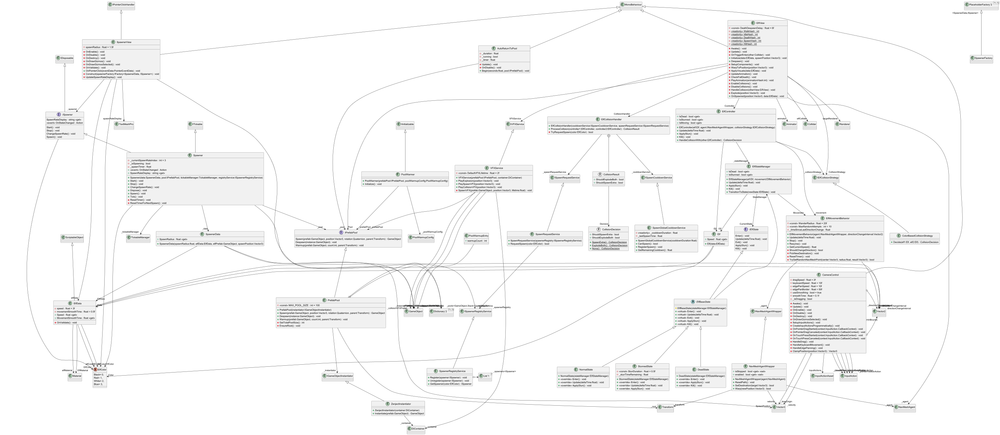

# Exploding Elves

A tiny Unity project that apply clean architecture + DI + pooling wrapped in a fun little demo: four color spawners drop “elves” that wander around. When two elves of the same color bump into each other, they trigger one extra spawn of that color. If the colors are different, both explode. You can change each spawner’s spawn interval by clicking on it.

## TL;DR (How to run)
- Open the project in Unity 6000.2.6f2 (that’s what it was built on).
- Open the Game Scene (the one with the GameInstaller/DI setup and 4 spawners).
- Press Play.
- You may press the spawners to change the intervals:
  - Change spawn interval (cycles through presets like Disabled, 3s, 6s, 12s, …)

You should see:
- Elves spawning from 4 different spawners (Black, Red, White, Blue)
- Elves wandering randomly
- Same‑color collisions cause one extra spawn (throttled by a short cooldown)
- Different‑color collisions make both elves explode (there’s a VFX service to hook visuals)

## What the prompt asked for 
- 4 spawners, one per color (black/red/white/blue)
  - Implemented with ISpawner/Spawner + SpawnerData entries for each color.
- Random movement
  - ElfMovementBehavior (pure C#) drives NavMesh agents via an interface wrapper.
- Same color collide → spawn one extra
  - Decided by IElfCollisionStrategy (ColorBasedCollisionStrategy), coordinated by ElfCollisionHandler + ISpawnRequestService.
- Different colors collide → both explode
  - Also decided by the strategy; VFX handled via IVFXService (presentation layer hook).
- Ability to change each spawner’s interval
  - Spawner exposes ChangeSpawnRate() and a SpawnRateDisplay string. Each spawner can be cycled independently.
- OOP, SOLID, IoC
  - Zenject composition in GameInstaller. Interfaces everywhere. Logic is cleanly separated from presentation.
- Business logic separated from presentation
  - Core logic in plain C# classes (POCOs). Unity‑specific bits live behind small adapters/components.
- Nice‑to‑have: tests
  - There are unit tests for core systems under Assets/ExplodingElves/Scripts/Tests.

## Architecture (the short tour)

The code leans into SOLID principles with Dependency Injection (Zenject) so things are easy to understand, swap, and test.

- Layers and responsibilities
  - Core (business logic): Spawner, Spawn services, Collision handler/strategy, Movement behavior, Pooling engine
  - Infrastructure: DI wiring (GameInstaller), concrete instantiator for Unity (ZenjectInstantiator), configuration helpers
  - Interfaces: thin contracts that decouple Unity APIs and let us unit test logic
  - Presentation: views/MonoBehaviours that sit on prefabs (e.g., ElfView) and call into core logic

- IoC / DI (Zenject)
  - GameInstaller binds interfaces to implementations (single composition root):
    - IElfCollisionStrategy → ColorBasedCollisionStrategy
    - ISpawnCooldownService → SpawnGlobalCooldownService (cooldown seconds exposed in inspector)
    - ISpawnRequestService → SpawnRequestService
    - ISpawnerRegistryService → SpawnerRegistryService
    - IPrefabPool → PrefabPool
    - IGameObjectInstantiator → ZenjectInstantiator (so core code never directly calls Instantiate)
    - IFactory<SpawnerData, ISpawner> → auto factory for Spawner
  - This keeps constructors clean and testable; Unity specifics are only at the edges.

- Key modules
  1) Spawners
     - Spawner implements ISpawner + ITickable (so no Update on MonoBehaviours). It tracks a current spawn rate, a timer, and calls into the pool to spawn.
     - SpawnerRegistryService allows “spawn an elf of color X” without knowing which scene object is responsible.
     - ChangeSpawnRate() cycles through a small set of intervals. SpawnRateDisplay returns a friendly label like “6s” or “Disabled”.

  2) Random movement
     - ElfMovementBehavior is a plain class that controls a NavMesh agent via an INavMeshAgentWrapper (interface). It picks random points within a radius, at random time intervals, and tells the agent to move.

  3) Collision rules
     - Strategy pattern via IElfCollisionStrategy. The color‑based strategy decides outcomes: same color ⇒ spawn extra; different colors ⇒ explode both.
     - ElfCollisionHandler is the coordinator: it stuns both, asks the strategy for the decision, and if needed requests a spawn through ISpawnRequestService (gated by ISpawnCooldownService).

  4) Pooling
     - IPrefabPool abstracts reuse of GameObjects. PrefabPool keeps a dictionary per prefab and an instance→prefab map, plus a tidy “__PoolsRoot” in the hierarchy.
     - There’s also warmup support and a simple max capacity to avoid runaway growth.
     - Instantiation itself is delegated to IGameObjectInstantiator (ZenjectInstantiator), which calls into the DI container so dependencies are honored.

  5) Services
     - SpawnRequestService asks the registry for the correct spawner (by color) and calls Spawn(). If the spawner is missing, it logs a warning (could be a place for structured logging if you want to extend).

- SOLID checklist (quick)
  - SRP: Each class has a clear, single job (Spawner spawns, PrefabPool pools, CollisionStrategy decides, etc.).
  - OCP: You can swap strategies or services by binding a different implementation in GameInstaller.
  - LSP/ISP/DIP: Everything depends on interfaces; Unity specifics are behind wrappers; controllers follow contracts.

## Project map (useful files)
- Assets/ExplodingElves/Scripts/Infrastructure/DI/GameInstaller.cs — all DI bindings happen here
- Assets/ExplodingElves/Scripts/Core/Spawners/Spawner.cs — ticking spawner logic + interval cycling
- Assets/ExplodingElves/Scripts/Core/Spawners/Services/SpawnRequestService.cs — request a spawn by color
- Assets/ExplodingElves/Scripts/Core/Characters/ElfMovementBehavior.cs — random wandering using NavMesh
- Assets/ExplodingElves/Scripts/Core/Characters/Collision/ColorBasedCollisionStrategy.cs — decides collision outcomes
- Assets/ExplodingElves/Scripts/Core/Characters/Collision/ElfCollisionHandler.cs — coordinates collision effects and spawn requests
- Assets/ExplodingElves/Scripts/Core/Pooling/PrefabPool.cs — reusable pool implementation
- Assets/ExplodingElves/Scripts/Core/Pooling/ZenjectInstantiator.cs — DI‑friendly prefab instantiation
- Assets/ExplodingElves/Scripts/Interfaces/* — interfaces for DI + test seams
- Assets/ExplodingElves/Scripts/Debug/MemoryOverlay.cs — quick on‑screen memory HUD

## Tests
There are unit tests under Assets/ExplodingElves/Scripts/Tests that cover core systems like the pool, collision strategy/handler, spawn services, and controller logic. They run as plain C# tests (EditMode) without needing Unity’s runtime objects, thanks to the interface seams.

Tips:
- Try running them with the Unity Test Runner or your IDE test runner (ExplodingElves.Test.csproj).

## Performance and memory
- Pooling avoids heavy Instantiate/Destroy churn, which reduces GC spikes.
- A basic cap (MAX_POOL_SIZE) is in place just to avoid accidental runaway pools.

## AI assistance note
I used AI tools to speed up code arch review and documentation (Claude 4.5/Gemini 2.5 PRO) and regular IDE assistance (Rider/JetBrains). 
All architecture decisions and final code were validated and adjusted by me. Any snippets were reviewed and tested to make sure they fit the project’s style and constraints.

Prompts used:
"Check if these scripts follows: SOLID principles, Inversion of Control (IoC) principle, KISS, YAGNI and DRY as well as clean code."
The prompt usually suggests improvements that I wasn't able to see and improve my coding speed. 

The Unit tests has been made pretty much fully with AI assistance (Claude 4.5). In order cover all core systems and do delivery in time.

*The only usage of a AI Agent (Junie) were to write this README.md file*

## License
Enjoy blowing up elves (kindly).
